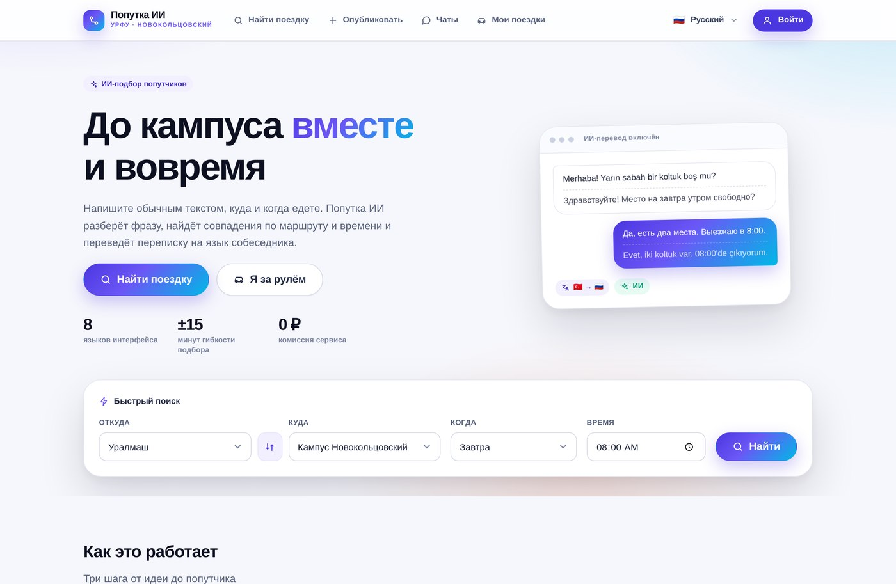
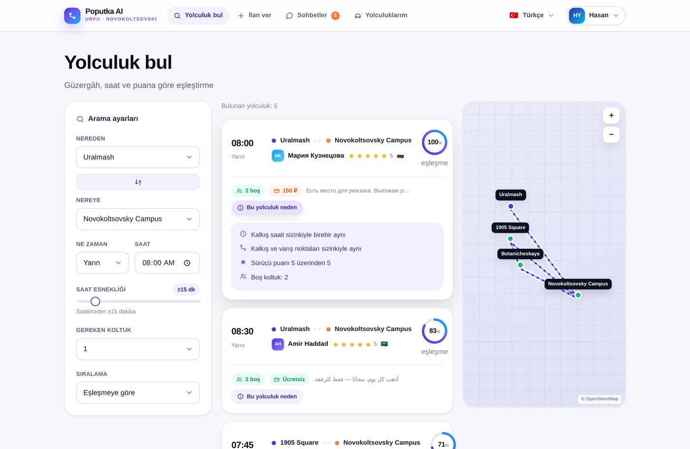
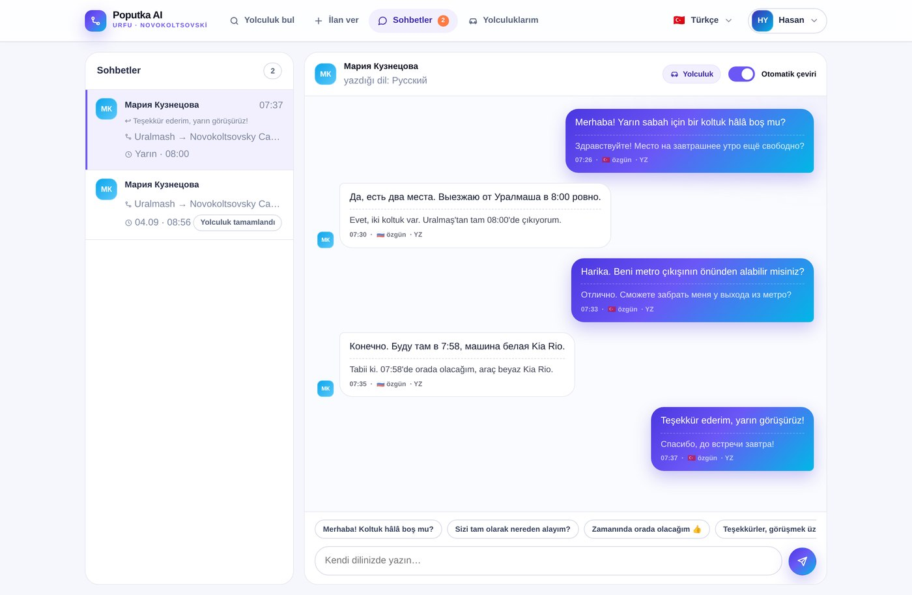
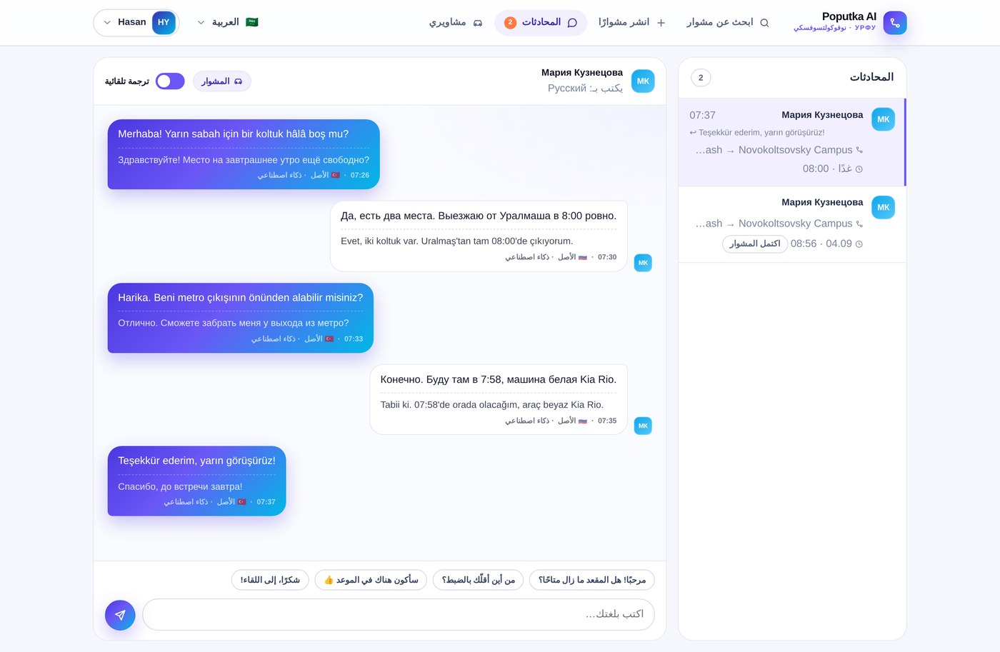
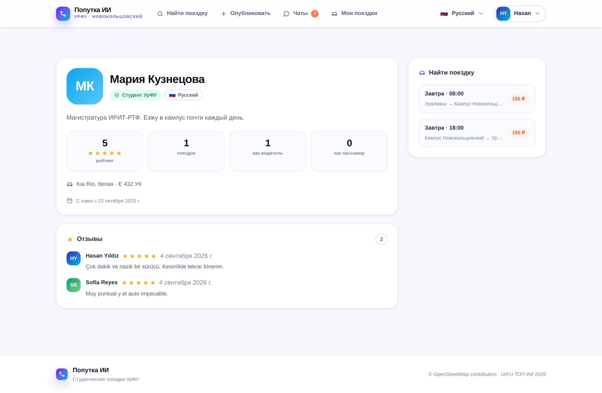
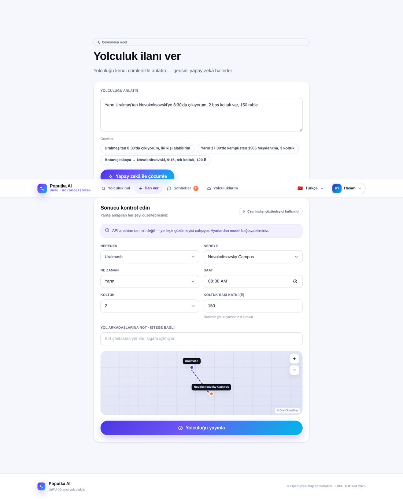
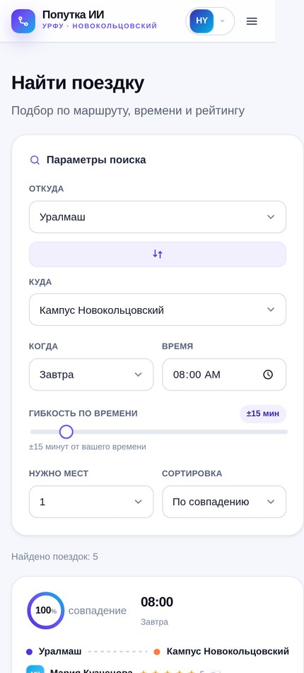
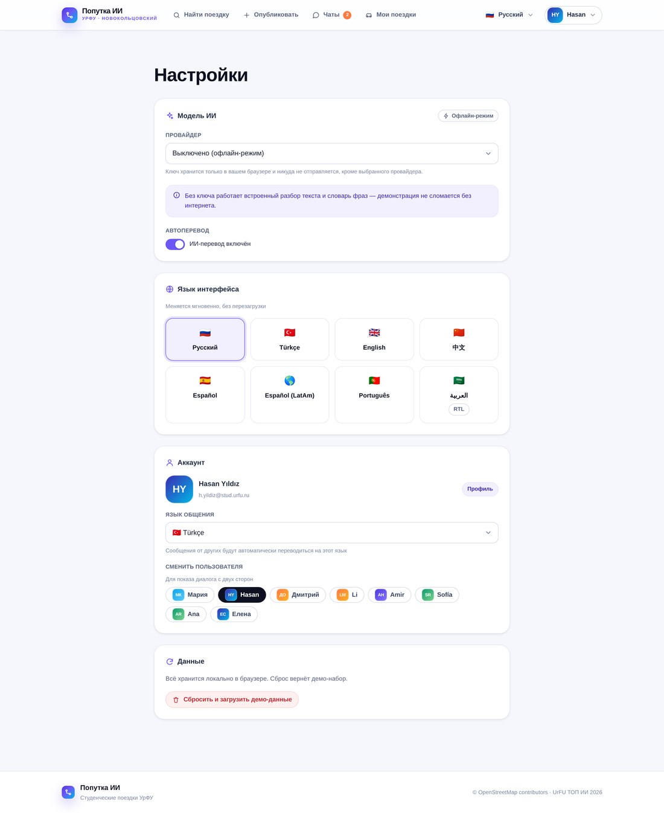

<div align="center">


# Попутка ИИ

**Умный сервис студенческих поездок между городом и кампусом Новокольцовский**

Хакатон УрФУ «ТОП ИИ» · Кейс 10

[](../../deployments)
[](#-запуск-30-секунд)
[](#-архитектура)
[](#-языки)
[](LICENSE)

[Türkçe README →](README.tr.md)



</div>

---

## Что это

Веб-приложение, которое помогает студентам УрФУ доехать до кампуса вместе.
Водитель пишет объявление **обычными словами** — ИИ превращает его в структурированную поездку.
Пассажир ищет попутку, получает список совпадений **с объяснением, почему предложена именно эта поездка**,
и договаривается в чате, где **каждое сообщение автоматически переводится на язык собеседника**.

Кампус Новокольцовский принимает студентов из десятков стран, поэтому языковой барьер здесь —
не украшение, а настоящая проблема. Это и есть ядро продукта.

---

## 🚀 Запуск (30 секунд)

Ни `npm install`, ни сборки, ни зависимостей.

```bash
git clone https://github.com/<организация>/<репозиторий>.git
cd <репозиторий>
python3 -m http.server 8000
```

Открыть <http://localhost:8000>.

Либо просто **открыть `index.html` двойным щелчком** — приложение заработает прямо из файла.

> Интернет нужен только для тайлов OpenStreetMap и веб-шрифта.
> Без сети приложение **не ломается**: карта переходит в схематичный режим,
> маршрут и остановки по-прежнему видны.

---

## 🌐 Публикация

### GitHub Pages (настроено, нажимать ничего не нужно)

В репозитории лежит workflow [`.github/workflows/pages.yml`](.github/workflows/pages.yml).
Один раз включить публикацию:

**Settings → Pages → Build and deployment → Source: `GitHub Actions`**

После этого каждый push в `main` автоматически обновляет сайт по адресу
`https://<организация>.github.io/<репозиторий>/`.

### Другие варианты

| Платформа | Что сделать |
|---|---|
| **Netlify** | перетащить папку на <https://app.netlify.com/drop> |
| **Vercel** | `vercel --prod` (статический проект, команда сборки пустая) |

---

## ✨ Возможности

| | Возможность | Где посмотреть |
|---|---|---|
| 🪄 | **Разбор обычной речи.** «Еду с Уралмаша в 8:30, могу взять двоих» → точка, время, места, цена | `Опубликовать` |
| 🎯 | **Подбор попутчиков** по маршруту, времени и рейтингу, с процентом совпадения | `Найти поездку` |
| 💬 | **Объяснение «почему эта поездка»** — по шаблонам, без обращения к модели: мгновенно и предсказуемо | кнопка на карточке |
| 🌍 | **Перевод в чате.** Каждое сообщение видно и в оригинале, и на языке читателя | `Чаты` |
| ⭐ | **Взаимный рейтинг** 1–5 звёзд с комментарием после поездки | `Мои поездки → Завершённые` |
| 🛡 | **Проверка студента** по адресу `@stud.urfu.ru` | `Вход` |
| 🗺 | **Карта** на тайлах OpenStreetMap — собственная реализация, без внешних библиотек | везде |
| 📱 | **Полная адаптивность** — интерфейс рассчитан на телефон | — |

### Языки

Русский (по умолчанию) · Türkçe · English · 中文 · Español · Español (LatAm) · Português · **العربية с полной поддержкой RTL**

Переключение мгновенное, без перезагрузки. В арабском раскладка зеркалится целиком —
навигация, карточки, чат, карта.

---

## 📸 Экраны

<table>
<tr>
<td width="50%"><br /><sub><b>Подбор с объяснением.</b> Процент совпадения и разбор: время, маршрут, рейтинг водителя.</sub></td>
<td width="50%"><br /><sub><b>Чат с автопереводом.</b> Оригинал сверху, перевод на язык читателя — снизу.</sub></td>
</tr>
<tr>
<td><br /><sub><b>Арабский, RTL.</b> Раскладка зеркалится полностью; текст на латинице и кириллице внутри сохраняет своё направление.</sub></td>
<td><br /><sub><b>Профиль и отзывы.</b> Рейтинг, число поездок как водителя и как пассажира.</sub></td>
</tr>
<tr>
<td><br /><sub><b>Разбор объявления.</b> Свободный текст → структурированная поездка, любое поле можно поправить.</sub></td>
<td align="center"><br /><sub><b>Телефон.</b> Целевая аудитория заходит именно отсюда.</sub></td>
</tr>
</table>

---

## 🤖 Подключение модели ИИ

**Приложение полностью работает без ключа.** Без него включается встроенный разбор объявлений
и словарь фраз для перевода — демонстрация не сломается ни без ключа, ни без интернета.

Чтобы подключить настоящую модель:

1. Получить бесплатный ключ:
   * **Groq** — <https://console.groq.com/keys> (llama-3.3-70b, щедрый бесплатный лимит)
   * **Google Gemini** — <https://aistudio.google.com/apikey> (gemini-2.0-flash)
2. В приложении: **Настройки → Модель ИИ** → выбрать провайдера, вставить ключ
3. Нажать **«Проверить ключ»** — зелёная галочка означает, что всё готово

> Ключ хранится только в `localStorage` браузера и не уходит никуда, кроме выбранного
> провайдера. В репозитории ключей нет и быть не должно.



---

## 🏗 Архитектура

Приложение написано на чистом JavaScript без фреймворка и без шага сборки — так его может
запустить и задеплоить любой участник команды за полминуты, а на защите нечему падать.

```
index.html                 единственная точка входа
styles/
  tokens.css               дизайн-система: палитра, типографика, отступы, тени, анимации
  base.css                 сброс стилей и типографика
  components.css           кнопки, поля, карточки, бейджи, пузыри чата, карта, модалки
  views.css                раскладки страниц, адаптив, RTL
src/
  util.js                  DOM-хелперы, дата/гео, набор иконок
  i18n.js                  движок переводов на 8 языков, управление RTL
  locales/*.js             файлы локализации — по 266 ключей, полное совпадение
  places.js                остановки Екатеринбурга: координаты и синонимы для парсера
  store.js                 СЛОЙ ДАННЫХ (абстрактный) — сейчас адаптер localStorage
  seed.js                  демо-данные: пользователи, поездки, чаты, оценки
  ai.js                    клиент Groq/Gemini + офлайн-парсер + словарь фраз
  matching.js              оценка совпадения и шаблонные объяснения
  map.js                   карта на тайлах OSM: проекция, перетаскивание, зум, фолбэк
  ui.js                    UI-кит: тосты, модалки, аватары, звёзды, кольцо, поля
  shell.js                 шапка, навигация, роутер
  views/*.js               экраны
  main.js                  инициализация
scripts/check-locales.js   сверка ключей локализации (запускается в CI)
```

### Алгоритм подбора

```
оценка = 0.50 · близость маршрута
       + 0.36 · разница во времени (окно гибкости ±5…90 минут)
       + 0.14 · рейтинг водителя
```

Близость маршрута считается по формуле гаверсинуса отдельно для точки отправления и точки
назначения. Объяснение «почему эта поездка» собирается **из шаблонов, а не моделью**: оно должно
появляться мгновенно, стоить ноль и никогда не выдумывать лишнего.

### Переход на настоящую базу данных

Весь доступ к данным идёт через объект `adapter` в [`src/store.js`](src/store.js)
(`load` / `save` плюс `all` / `find` / `where` / `insert` / `update` / `remove`).
Чтобы перейти на Supabase или Firebase, достаточно заменить этот объект — экраны не меняются.

---

## 🎬 Сценарий показа (5 минут)

1. **Главная** — переключить язык с русского на арабский: интерфейс мгновенно разворачивается в RTL.
2. **Опубликовать** — ввести: *«Завтра еду с Уралмаша в кампус в 8:30, могу взять двоих, 150 рублей»*
   → «Разобрать с ИИ» → готовое объявление и маршрут на карте.
3. **Найти поездку** — раскрыть «Почему эта поездка»: разница во времени, совпадение маршрута, рейтинг.
4. **Чаты** — переписка Hasan (турецкий) ↔ Мария (русский); в каждом сообщении оригинал и перевод.
   В меню пользователя **сменить пользователя** — тот же диалог со стороны собеседника.
5. **Мои поездки → Завершённые** — поставить оценку и показать, как обновился рейтинг в профиле.

---

## 🚧 Вне рамок MVP

Динамическое ценообразование и прогноз спроса присутствуют в исходной формулировке кейса,
но сознательно вынесены за рамки этой версии. Вместо настоящего сервиса подтверждения почты
используется проверка формата адреса `@stud.urfu.ru`.

---

## 🤝 Команда

Как сообщать об ошибках, предлагать правки интерфейса и переводов —
в [CONTRIBUTING.md](CONTRIBUTING.md).

## Лицензия

[MIT](LICENSE)
